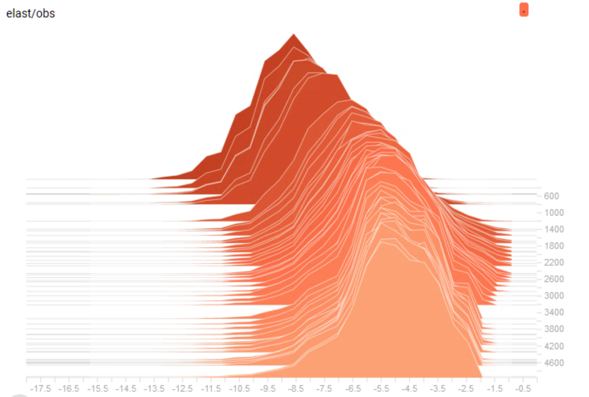

## Joining Deep Learning and Causal Inference
This project is inspired by the literature around [Double/Debiased Machine Learning](https://arxiv.org/abs/1608.00060) for Treatment and Causal Parameters, and around [*Deep Instrumental Variable Models*](https://arxiv.org/abs/1612.09596). As a side project, I implemented an estimator in tensorflow that used a wide and deep neural network both for controlling confounders and estimating elasticity as a function of product features.

The estimator yielded reasonable estimates, both on simulated data and on real data from major ecommerce platforms. My model did not appear to significantly outperform the technologies I used during my day job at QuantCo, but it was instrumental in furthering our understanding of emerging ideas.

Since this side project merges my (NDA'd) professional work at the time with my private research interests, code and documentation unfortunately are available only on request.

The TensorBoard screenshot below shows the distribution of elasticity over products, shown over training epochs.

